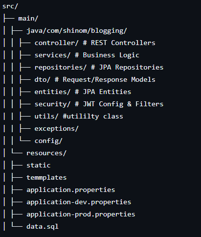

# 🧠 AI-Powered Blogging Application - Backend

✅ Requirements
Java 17+

Maven

MySQL

Google Cloud Perspective API Key

This is the backend of the AI-Powered Blogging Application, built with **Spring Boot**. It provides RESTful APIs for user registration, login, blog creation, comment management, and integrates with **Google Perspective API** to detect and filter toxic content.

---

## 🚀 Features

- 🔐 **User Authentication & Authorization** (JWT-based)
- 🧑‍💼 **Role-based Access Control** (Admin, User)
- 📝 **Blog CRUD Operations** with pagination and search
- 💬 **Comment System** with toxicity detection
- 🌐 **Google Perspective API Integration** to detect offensive content
- 🧹 **Soft Delete** for blog posts and comments
- 📦 **Modular Architecture** for better maintainability
- 📄 **Swagger/OpenAPI Documentation**

---

## 🧰 Tech Stack

- **Spring Boot**
- **Spring Security + JWT**
- **Spring Data JPA + Hibernate**
- **MySQL** (or any RDBMS)
- **Google Perspective API**
- **Lombok**, **MapStruct**, **ModelMapper**
- **Maven**
- **Swagger UI**

---

## 🗂️ Project Structure


## 🔑 Security Overview

- JWT is issued after login and must be passed in `Authorization: Bearer <token>` header.
- Admins can manage all blogs/comments, while users can only modify their own.
- Sensitive routes are protected with role-based access.

## 🤖 Toxicity Detection

This app integrates **Google Perspective API** to analyze user-submitted post and reject creation of post automatically.

## 🔧 How to Run

### 1. Clone the Repository

```bash
git clone https://github.com/yourusername/AI-Powered-Blogging-Application_Backend.git
cd AI-Powered-Blogging-Application_Backend

